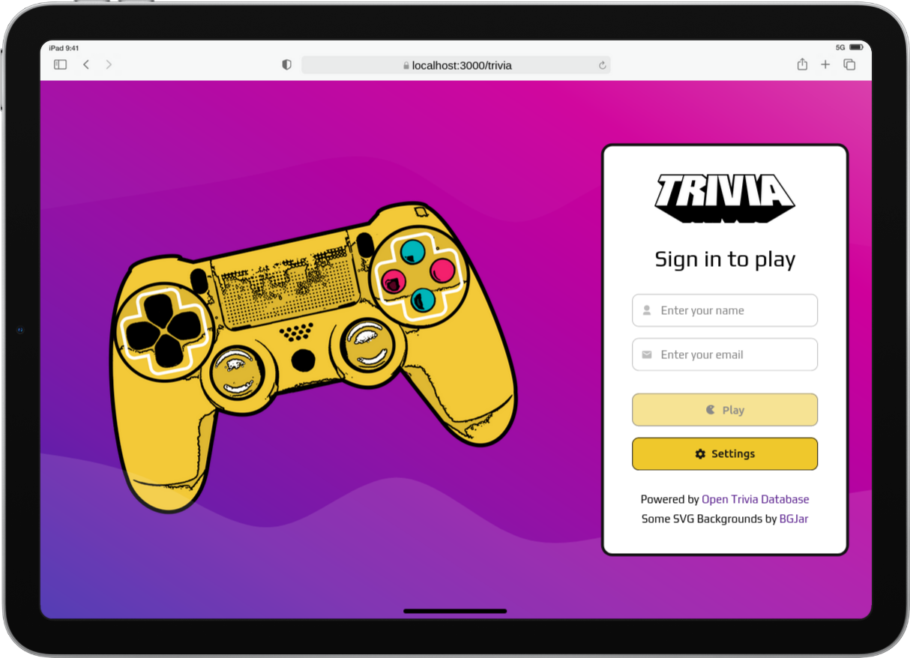
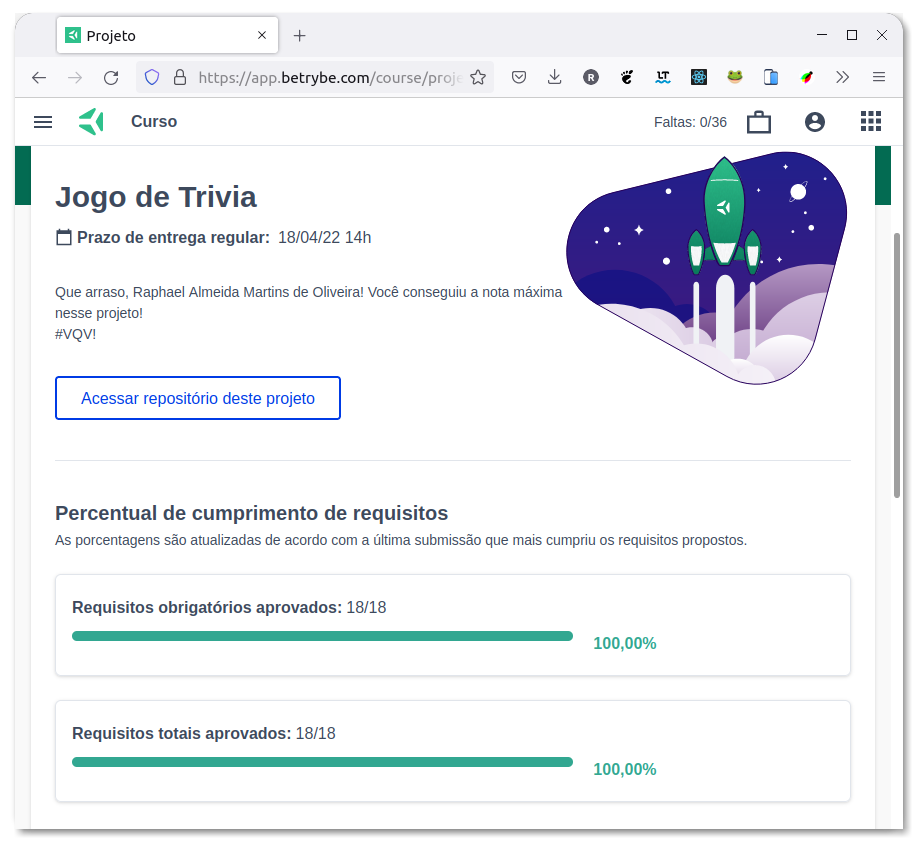

# :interrobang: Trivia :brain:

## :page_with_curl: About

React group project developed by [Raphael Martins](https://www.linkedin.com/in/raphaelameidamartins/), [Vitória Holanda](https://www.linkedin.com/in/vit%C3%B3ria-holanda-500a32215/), [Thais Kotovicz](https://www.linkedin.com/in/thaiskotovicz/), [Lucas Cabral](https://www.linkedin.com/in/lucas-cabral-0a2678221/), [Elisa Taborda](https://www.linkedin.com/in/elisa-taborda-62b0b6221/) at the end of Unit 16 ([Front-end Development Module](https://github.com/raphaelalmeidamartins/trybe_exercicios/tree/main/2_Desenvolvimento-Front-end)) of Trybe's Web Development course. We were approved with 100% of the mandatory and optional requirements met.

We had to develop a Trivia game React application fetching for question data from a public API. We also had to use agile methologies such as Scrum and Kanban.

[Click here](https://raphaelalmeidamartins.github.io/trivia/) to check out the final version of the project on your browser.

## :memo: Methodologies

* Kanban
* Scrum

## :man_technologist: Developed Skills

* Work in group using agile development methodologies
* Develop a React application using React Router
* Develop a React application using Redux
* Fetch data from a public API

## :hammer_and_wrench: Tools

* HTML5
* CSS3
* JavaScript ES6+
* React.js
* React Router
* Redux
* React Icons (icon library)
* GitHub Pages

## :iphone: Mobile version

## :trophy: Grade

### :copyright: Copyright disclaimer

We developed this project for learning purposes, all the code and documentation texts are our authorship, and the rights belong exclusively to us. It is allowed to download or clone the repository for study purposes. However, it is not allowed to publish full or partial copies. This disclaimer does not cover libraries and dependencies, which are subject to their respective licenses.

We use the [Open Trivia Database](https://opentdb.com/) API to fetch the recipes' data.
